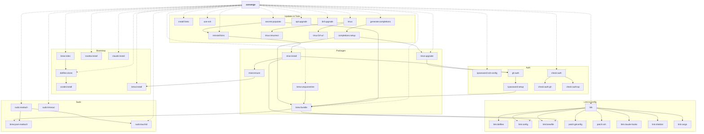

# Taskfile DAG

Dependency graph for `task converge`. Dotted lines = converge's direct deps. Solid lines = task-to-task deps. All tasks are idempotent via `status:` checks.

```mermaid
flowchart TD
    converge["<b>converge</b>"]

    subgraph boot ["Bootstrap"]
        xcode["xcode:install"]
        clone["dotfiles:clone"]
        roles["brew:roles"]
        brew_inst["brew:install"]
        rosetta["rosetta:install"]
        claude["claude:install"]
    end

    subgraph authn ["Auth"]
        op_setup["1password:setup"]
        op_ssh["1password:ssh-config"]
        gh["gh:auth"]
        check["check:auth"]
        check_gh["check:auth:gh"]
        check_op["check:auth:op"]
    end

    subgraph sec ["Sudo"]
        pam["brew:pam-reattach"]
        touchid["sudo:touchid"]
        reattach["sudo:reattach"]
        timeout["sudo:timeout"]
    end

    subgraph pkg ["Packages"]
        bundle["brew:bundle"]
        unq["brew:unquarantine"]
        mise_e["mise:ensure"]
        mise_i["mise:install"]
        mise_up["mise:upgrade"]
    end

    subgraph cfg ["Link & Config"]
        link["link"]
        link_dots["link:dotfiles"]
        link_conf["link:config"]
        link_brew["link:brewfile"]
        patch_git["patch:gitconfig"]
        patch_ssh["patch:ssh"]
        link_claude["link:claude-hooks"]
        link_sheldon["link:sheldon"]
        link_cargo["link:cargo"]
    end

    subgraph upd ["Updates & Tools"]
        fonts["install:fonts"]
        reinstall["reinstall-bins"]
        use_ssh["use-ssh"]
        tmux["tmux"]
        tmux_r["tmux:resurrect"]
        tmux_f["tmux:fzf-url"]
        comps["generate:completions"]
        comp_setup["completions:setup"]
        apt["apt:upgrade"]
        dnf["dnf:upgrade"]
        secrets["secrets:populate"]
    end

    %% Converge direct deps (dotted)
    converge -.-> clone & brew_inst & roles & rosetta & claude
    converge -.-> unq & touchid & reattach & timeout & op_ssh
    converge -.-> reinstall & use_ssh & link & check & fonts
    converge -.-> bundle & apt & dnf & mise_up & tmux & comps & secrets

    %% Secrets
    secrets --> bundle & reinstall

    %% Bootstrap
    clone --> xcode
    roles --> clone

    %% Auth
    op_setup --> bundle
    gh --> op_setup
    check --> check_gh & check_op

    %% Sudo
    reattach --> pam & touchid

    %% Packages
    bundle --> link_brew & pam
    unq --> bundle
    mise_e --> brew_inst
    mise_i --> mise_e & gh & link_conf
    mise_up --> gh

    %% Link
    link --> link_dots & link_conf & patch_git & patch_ssh
    link --> link_brew & link_claude & link_sheldon & link_cargo

    %% Updates
    reinstall --> mise_i
    tmux --> tmux_r & tmux_f
    comps --> comp_setup
    comp_setup --> bundle & mise_up
```
